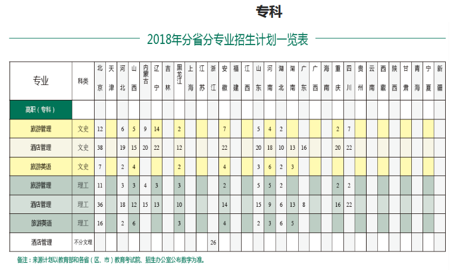

# 高校清单

## 一、总览

### 说明

该清单的高校数据采集自**教育部的2018全国普通高等学校名单**，根据各个学校的办学层次、往年录取分数线、2018年招生计划(分专业)方面数据，综合筛选出的清单。

所筛选的高校全部位于北京、天津、河北。对此的考虑是。。。

### 分地区一览表

> 办学层次： 指该学校招收的报考类型

| 学校名称 | 主管部门 | 所在地 | 办学层次 | 备注 |
| :- | :-: | :-: | :-: | :-: |
| 北京市(6所) |  |  |  |  |
| [中国劳动关系学院](#中国劳动关系学院) | 中华全国总工会 | 北京市 | 本科/专科 |  |
| 北京京北职业技术学院 | 北京市 | 北京市 | 专科 |  |
| 北京交通职业技术学院 | 北京市 | 北京市 | 专科 |  |
| 北京青年政治学院 | 北京市 | 北京市 | 专科 |  |
| 北京财贸职业学院 | 北京市 | 北京市 | 专科 |  |
| 天津市(6所) |  |  |  |  |
| 天津天狮学院 | 天津市教委 | 天津市 | 本科 | 民办 |
| 天津市职业大学 | 天津市 | 天津市 | 专科 |  |
| 天津工程职业技术学院 | 天津市 | 天津市 | 专科 |  |
| 天津电子信息职业技术学院 | 天津市 | 天津市 | 专科 |  |
| 天津现代职业技术学院 | 天津市 | 天津市 | 专科 |  |
| 天津公安警官职业学院 | 天津市 | 天津市 | 专科 |  |
| 天津轻工职业技术学院 | 天津市 | 天津市 | 专科 |  |
| 天津商务职业学院 | 天津市 | 天津市 | 专科 |  |
| 天津国土资源和房屋职业学院 | 天津市 | 天津市 | 专科 |  |
| 天津医学高等专科学校 | 天津市 | 天津市 | 专科 |  |
| 天津开发区职业技术学院 | 天津市 | 天津市 | 专科 |  |
| 天津艺术职业学院 | 天津市 | 天津市 | 专科 |  |
| 天津交通职业学院 | 天津市 | 天津市 | 专科 |  |
| 天津冶金职业技术学院 | 天津市 | 天津市 | 专科 |  |
| 天津石油职业技术学院 | 天津市 | 天津市 | 专科 |  |
| 天津城市职业学院 | 天津市 | 天津市 | 专科 |  |
| 天津铁道职业技术学院 | 天津市 | 天津市 | 专科 |  |
| 天津工艺美术职业学院 | 天津市 | 天津市 | 专科 |  |
| 天津城市建设管理职业技术学院 | 天津市 | 天津市 | 专科 |  |
| 天津生物工程职业技术学院 | 天津市 | 天津市 | 专科 |  |
| 天津海运职业学院 | 天津市 | 天津市 | 专科 |  |
| 天津广播影视职业学院 | 天津市 | 天津市 | 专科 |  |
| 天津体育职业学院 | 天津市 | 天津市 | 专科 |  |  |
| 天津滨海汽车工程职业学院 | 天津市教委 | 天津市 | 专科 | 民办 |

## 二、详细

### 说明

以下部分就本年招生计划、本年招生简章、历年分数线等方面进行说明，数据全部来自于各个高校官网

### 分项说明

---
---

#### 中国劳动关系学院

**官网**

> http://www.culr.edu.cn/

**招生网**

> http://news.culr.edu.cn/zhaosheng/

**招生简章**

> http://news.culr.edu.cn/zhaosheng/bkzn/xxzszc/lnbkzn/43238.htm

**招生计划**



**2017年分数线**


**说明**

```words
1、该校有两个学区，一个在涿州，一个在北京市，一些专业第一年在涿州校区，第二年转到北京市校区，具体见招生简章说明
2、普通专科学费6000每年
```

[回到顶端](#分地区一览表)

---

#### 北京京北职业技术学院

**官网**
> 

**招生简章**
> 

**招生计划**
> 

**2017年分数线**


**说明**
> 

[回到顶端](#分地区一览表)

---

#### 北京交通职业技术学院

**官网**
> 

**招生简章**
> 

**招生计划**
> 

**说明**
> 

---

#### 北京青年政治学院

**官网**
> 

**招生简章**
> 

**招生计划**
> 

**说明**
> 

---

#### 北京财贸职业学院

**官网**
> 

**招生简章**
> 

**招生计划**
> 

**说明**
> 

---
---

#### 天津天狮学院

**官网**
> 

**招生简章**
> 

**招生计划**
> 

**说明**
> 

---

#### 天津市职业大学

**官网**
> 

**招生简章**
> 

**招生计划**
> 

**说明**
> 

---

#### 天津工程职业技术学院

**官网**
> 

**招生简章**
> 

**招生计划**
> 

**说明**
> 

---

#### 天津电子信息职业技术学院

---

#### 天津现代职业技术学院

---

#### 天津公安警官职业学院

---

#### 天津轻工职业技术学院

---

#### 天津商务职业学院

---

#### 天津国土资源和房屋职业学院

---

#### 天津医学高等专科学校

---

#### 天津开发区职业技术学院

---

#### 天津艺术职业学院

---

#### 天津交通职业学院

---

#### 天津冶金职业技术学院

---

#### 天津石油职业技术学院

---

#### 天津城市职业学院

---

#### 天津铁道职业技术学院

---

#### 天津工艺美术职业学院

---

#### 天津城市建设管理职业技术学院

---

#### 天津生物工程职业技术学院

---

#### 天津海运职业学院

---

#### 天津广播影视职业学院

---

#### 天津体育职业学院

---

#### 天津滨海汽车工程职业学院

---

